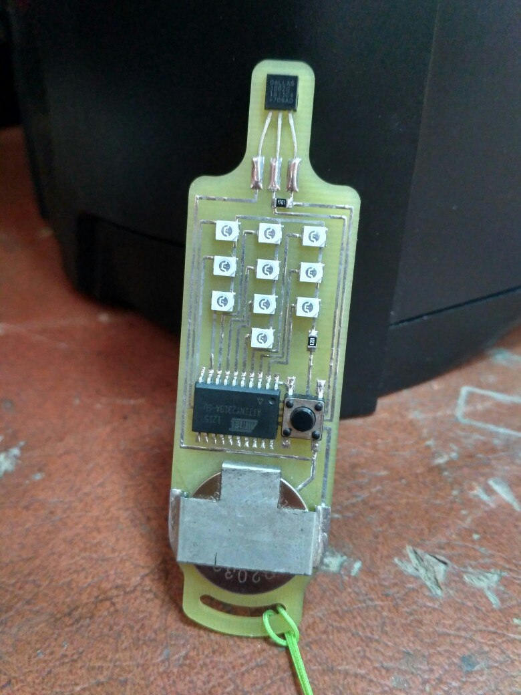

# ds18b20-pocket-thermo

 

Цифровой карманный брелок-термометр со светодиодной индикацией

Содержание:

ASM - исходник на ассемблере AVR Studio 4.19 (коментарии на русском, но на гитхабе они побились кодировкой)

HEX - прошивка для заливки (FUSE LOW 0xC6, FUSE HIGH 0xDF - для AVRDUDESS)

KOMPASS - чертеж платы в Компас 3D v13

LAYOUT - печатная плата Sprint Layout 6.0

PROTEUS - принципиальная схема, она же модель для симуляции ISIS Proteus 7

SPRUTCAM - для лакшери радиолюбителей у кого есть ЧПУ фрезер программа фрезерования платы SprutCAM 7

Описание:

Индикация светодиодами по образу цифровой клавиатуры сотового телефона. Диапазон измеряемых/отображаемых температур полный как у самого датчика (-55...+128). Округление до целого +-0,5 градуса. Положительные температуры показывает миганием (+128 градусов мигнет "один-два-восемь"). Отриацтельные температуры показывает с нулем в начале (-55 градусов мигнет "ноль-пять-пять"). Если происходит ошибка чтения датчика то мигает тремя нулями подряд. 

Осуществляется принудительный перевод датчика в режим 9 бит, тактирование микроконтроллера от внутренних 128 кГц, питание от cr2032, при опросе датчика выполняется проверка контрольной суммы. 

Во время бездействия микроконтроллер в режиме Power-down, во время опроса датчика потребление около 1.5 мА, во время индикации около 2 мА. Датчик запитывается от ноги микроконтроллера только на время опроса. Резистор подтяжки датчика 4.7 кОм, резистор в цепи катодов светодиодов 1.2 кОм (это если сверхяркие зеленые, в иных случаях подбирается индивидуально по закону Ома). 

Не перепутайте питание! Минус батарейки к плате, плюс батарейки к металлической клипсе (см. фото).
Если протеус будет ругаться надо заново указать файл прошивки и в меню "Исходник-Добавить/Удалить файл исходного кода" удалить указанный для микроконтроллера файл исходника. 
